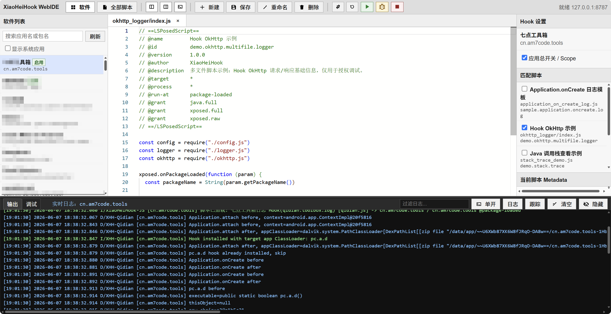

    
    
    

# 项目简介

> ⚠️ 模块属于自用开发阶段，出现问题请提 PR，不确保不同品牌手机的兼容性。

XiaoHeiHook 是 **一个基于现代 LSPosed 与 Rhino 的动态 Hook 脚本模块**。

目标是让开发者能够使用极简的 JS 脚本调用 LSPosed 提供的强大 Hook 功能，而无需为了每个应用程序都撰写一个独立的 LSPosed 模块。

在现代设备上，LSPosed 注入的隐藏能力已经远大于 Firda 脚本，使用 LSPosed 框架编写代码可以减少大部分环境问题。

此外，该模块尝试提供一种类似 Firda 脚本的体验：

- **快速上手**：只需编写 JS 脚本，无需额外 Java/Kotlin 开发。
- **多应用支持**：同一脚本可在不同应用中复用，并能针对每个应用独立配置开关和参数。
- **动态执行**：脚本可在目标应用运行时被加载、修改和调试，无需重启应用或重新安装模块。
- **可视化配置**：提供丰富的设置项支持，包括布尔值、数字、字符串、下拉选择、多选、列表等类型，让脚本行为可控。
- **兼容性与安全性**：封装 LSPosed 现代接口，保证 Hook 稳定运行，同时通过脚本沙箱和 schema 校验减少运行时错误和安全风险。
- **开发者友好**：提供 WebIDE 和日志系统支持，方便调试、断点和查看远程日志，形成完整的开发闭环。

总体而言，XiaoHeiHook 的设计理念是 **“轻量 JS + 强大 Hook”**，它把 LSPosed 的复杂 Hook 逻辑抽象成可直接使用的 JS 接口，让开发者专注于业务逻辑而非底层实现，同时兼顾安全性与可维护性.

## 它解决的问题

传统 Xposed 模块通常需要为每一次逻辑修改重新编译、安装、重启目标应用，调试成本较高。  
XiaoHeiHook 将固定模块与动态脚本拆开：模块负责接入 LSPosed、同步脚本、创建 JS Runtime；脚本负责描述具体 Hook 行为。

因此你可以把它理解为：

## 核心特性

- 使用 Rhino 执行 JavaScript 脚本。
- 使用现代 libxposed 风格链式 Hook API。
- 支持按应用启用脚本。
- 支持按应用、按脚本保存独立设置项。
- 支持多文件脚本与 CommonJS `require`。
- 支持手机端管理脚本和 WebIDE 在线编写脚本。
- 支持终端日志查看、实时日志流与外部编辑器打开日志。
- 支持脚本行断点、软断点相关调试接口。

## WebIDE 演示

XiaoHeiHook 提供原生 WebIDE 集成环境，只需要浏览器即可编写脚本。

WebIDE 中支持断点调试等功能，便于编写脚本。

# 快速开始

## 环境搭建

> ⚠️ **模块仅支持现代 API 接口（API101），请确保 LSPosed 管理器支持新接口的模块。**

你需要准备：

- 安装 LSPosed 并且确保版本 >= 2.0.4
- 已安装 XiaoHeiHook 管理端应用。
- 已在 LSPosed 中启用 XiaoHeiHook 模块。
- 对需要 Hook 的目标应用启用模块作用域（可选，模块会自动申请）。
- 授予 XiaoHeiHook 管理脚本目录所需的文件权限。
- 授予 XiaoHeiHook Root 权限（可选，主要用于重启应用）

## 下载脚本

我们在仓库的 `example` 目录下放置了一些示例脚本，演示了目前该模型的一些能力，可以用作开放参考。

您需要将脚本复制到当前用户的 `Documents/XiaoHeiHook` 目录下，模块会扫描该目录以为应用程序配置脚本。

## 开发脚本

脚本的开放说明请参考开放文档，文档中也说明了模块的实现思路，所有 JS 保留的接口均可在 [从 LSPosed 到 JS 脚本](https://lab.lovepikachu.top/document/xiaoheihook/scripts/bridge.html) 章节找到对应说明。

## 参考文档与帮助

如果你在使用过程中遇到问题，建议优先查阅项目文档：

- 项目文档：<https://lab.lovepikachu.top/document/xiaoheihook/welcome/introduction.html>
- 开源仓库：<https://github.com/wojiaoyishang/XiaoHeiCat/>
- 问题反馈：<https://github.com/wojiaoyishang/XiaoHeiCat/issues>
- 功能建议：欢迎提交 Issue 或 Pull Request

XiaoHeiHook 的设计与实现过程中参考了以下优秀项目，同时有助于您更好的开发脚本：

- LSPosed（现代 Xposed 框架）
    - <https://github.com/LSPosed/LSPosed>

- Modern Xposed API（libxposed）
    - <https://github.com/libxposed>

- Rhino JavaScript Engine
    - <https://github.com/mozilla/rhino>

- JsHook
    - <https://github.com/Xposed-Modules-Repo/me.jsonet.jshook>

- SimpleHook
    - <https://github.com/Xposed-Modules-Repo/com.github.kyuubiran.simplehook>