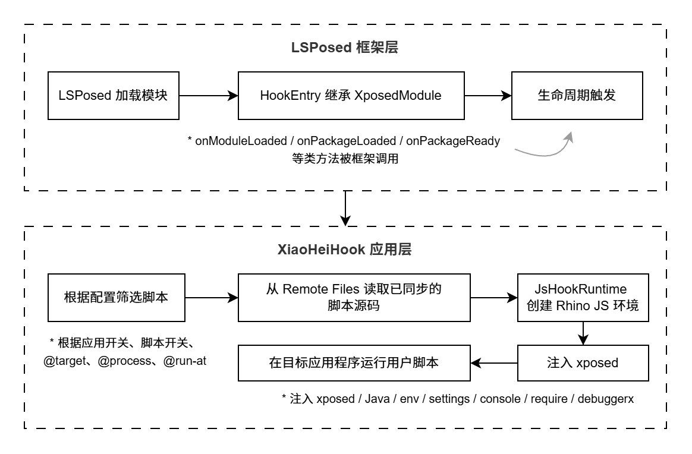

从 LSPosed 到 JS 脚本
====================================

XiaoHeiHook 的 JS API 是对现代 LSPosed/libxposed API 的一层脚本化封装。理解这层映射关系，有助于判断某个 JS 方法背后实际调用的是哪个 libxposed 能力。

.. important::

   从 ``1.31 (108)`` 起，XiaoHeiHook 明确 JS 与 Java 之间的变量传递边界：
   **从 LSPosed / 目标 App Java 层传入 JS 的对象，保持现有 JS API 行为**，例如
   ``chain``、``chain.getArg(index)``、``chain.getArgs()``、``chain.getThisObject()`` 和
   ``chain.proceed()`` 仍按 XiaoHeiHook 原有封装方式交给脚本使用。

   只有当脚本主动把值传回 Java 方法、构造器、字段写入或 ``Method.invoke(...)`` 时，Bridge
   才执行 JS → Java 参数转换：如果传入值已经是 Java 对象、Java wrapper、``NativeJavaObject``
   或其他非 JS 对象，则会解包后原样传递；如果传入值是 JS 字符串、数字、布尔值、数组或普通对象，
   才会根据目标 Java 参数类型自动转换。

.. tip::

	虽然代码是通过 JS 脚本进行编写的，但是对于处理一些来自 Java 层的对象（如 Java 的 String），不建议直接使用：
	 
	.. code-block:: javascript
	
		"com.example.app" !== param.getPackageName()  // 这样比较始终返回 false，因为类型对不上
		
	的方式进行比较，而是使用：
		
	.. code-block:: javascript
	
		param.getPackageName().equals("com.example.app")  // 使用 Java 的比较方法
		// 或者
		"com.example.app" !== String(param.getPackageName())  // 先进行一次数据类型转化
		
	在使用 Java 对象和 JS 对象进行脚本编写的时候需要注意。
	
	更多语法边界和说明参考 :ref:`脚本语法边界` 章节。

脚本语法与 ``const`` 限制
--------------------------------------

XiaoHeiHook 当前默认 JS 引擎是 Rhino。它不是浏览器、Node.js 或 QuickJS/V8，
因此脚本语法应以 Android Hook 场景中的稳定执行为优先。

.. important::
	从 ``1.30 (106)`` 开始，XiaoHeiHook 会在运行时启用 ES6 解析能力，并通过``xhh.jsEngine()`` 暴露真实语法能力检测结果。但需要特别注意：当前 Rhino 可以解析``const``，却不能可靠实现 ``for`` 循环体内 ``const`` 的每轮重新绑定语义。

不要把随循环下标变化的值写成下面这种形式：

.. code-block:: javascript

   for (let i = 0; i < paths.length; i++) {
     const path = String(paths[i]);
     xposed.i(TAG, "path=" + path);
   }

在部分 Rhino 环境中，第二轮及后续循环可能仍然读到第一轮绑定值。典型表现是
``paths`` 本身不同，但日志连续输出同一个 ``path``。

推荐通用写法一：循环内变化值使用 ``let``。

.. code-block:: javascript

   for (let i = 0; i < paths.length; i++) {
     let path = String(paths[i]);
     xposed.i(TAG, "path=" + path);
   }

推荐通用写法二：对数组、JS 数组风格返回值使用 ``xhh.each``。

.. code-block:: javascript

   xhh.each(paths, function (path, i) {
     xposed.i(TAG, "path[" + i + "]=" + path);
     return true;
   });

``const`` 仍可用于模块级常量、函数外固定配置、不会在循环中重新绑定的值，例如
``const TAG = "Demo"``。但在 Hook 回调、Dex 文件遍历、方法搜索结果遍历等场景中，
建议优先使用上面的通用语法。

JS Runtime 作用域与回调
--------------------------------------

从 ``1.31 (108)`` 起，XiaoHeiHook 调整了 Rhino Runtime 的作用域管理方式，使脚本更接近
普通 JavaScript 的全局变量语义。

每个脚本 Runtime 会持有一个长期存在的 global scope。脚本首次执行时创建该 scope，之后
``xposed.hook(...).intercept``、``Java.proxy``、自动 SAM proxy、``Handler.post(function () {})``
以及 ``xhh.rpc.register_method`` 的回调，都会优先回到 JS 函数创建时所属的 scope 执行。

这意味着下面这些状态可以在同一个脚本内跨回调递增：

.. code-block:: javascript

   const TAG = 'ScopeDemo';

   let topLetCounter = 0;
   var topVarCounter = 0;
   const state = { count: 0 };

   xposed.hook(method).intercept(function (chain) {
       topLetCounter++;
       topVarCounter++;
       state.count++;
       xposed.i(TAG, 'count=' + state.count);
       return chain.proceed();
   });

.. tip::

   ``1.31 (108)`` 修复的是 Hook / Java callback / RPC callback 回到同一脚本作用域的问题。
   Rhino 在 ``for`` 循环体内 ``const`` 的每轮重新绑定限制仍然存在；循环内变化值仍推荐使用
   ``let`` 或 ``xhh.each``。

跨脚本或跨多个回调共享运行期对象时，可以使用 ``xhh.global``。它是 Java-backed 状态表，
适合保存 Java ``Method``、``thisObject``、``ClassLoader`` 这类不能简单序列化的对象。

.. code-block:: javascript

   xposed.hook(targetMethod).intercept(function (chain) {
       const method = chain.getExecutable();
       method.setAccessible(true);

       xhh.global.set('demo.method', method);
       xhh.global.set('demo.this', chain.getThisObject());

       return chain.proceed();
   });

   xhh.rpc.register_method('call_demo_method', function (params) {
       const method = xhh.global.get('demo.method');
       const thisObject = xhh.global.get('demo.this');

       if (!method) {
           return { ok: false, error: 'method not captured yet' };
       }

       return {
           ok: true,
           result: '' + method.invoke(thisObject, params.value)
       };
   });

.. warning::

   ``xhh.global`` 只在当前目标 App 进程内有效。目标 App 被强制停止、进程崩溃或重新启动后，
   里面保存的值会丢失。需要持久化的数据应写入文件或配置。

整体调用链
------------------

XiaoHeiHook 的执行脚本链路可以理解为：

整体调用链可以理解为从 LSPosed 框架层进入 XiaoHeiHook 应用层的执行流程。

首先，LSPosed 在目标进程中加载模块，进入继承自 ``XposedModule`` 的 ``HookEntry``。随后框架会按时机触发生命周期方法，例如 ``onModuleLoaded``、``onPackageLoaded``、``onPackageReady`` 等。

进入 XiaoHeiHook  的 Hook 入口之后，模块不会直接执行全部脚本，而是先根据配置进行筛选，包括应用开关、脚本开关、``@target``、``@process``、``@run-at`` 等条件。只有匹配当前应用和进程的脚本才会继续执行。

筛选完成后，XiaoHeiHook 会从 Remote Files 中读取已经同步到 LSPosed 的脚本源码，并交给 ``JsHookRuntime``。运行时负责创建 Rhino JavaScript 环境，注入 ``xposed``、``Java``、``env``、``settings`` 等全局对象。

最后，用户脚本在 JS 环境中运行，通过 ``xposed.hook`` 等接口间接调用现代 LSPosed/libxposed 的 Hook 能力，从而完成方法拦截、日志输出、配置读取等操作。

脚本文件、Remote Files 与目标 App 私有目录
----------------------------------------------

从 ``1.30 (107)`` 起，多文件脚本的 ``assets/`` 资源会随脚本一起同步到 LSPosed Remote Files。
目标进程中的 JS 运行时通过 ``xhh.fs`` 读取这些资源，再按需复制到目标 App 私有目录。

这条链路可以理解为：

.. code-block:: text

   Documents/XiaoHeiHook/<script>/assets/
      => XiaoHeiHook 管理端同步
      => LSPosed Remote Files
      => 目标进程 xhh.fs 读取
      => context.getFilesDir() 下的安全子目录
      => ImageView / WebView / 目标 App Java API 使用

.. important::
   Remote Files 是脚本同步机制的一部分，不等于目标 App 自己的可访问文件目录。
   如果目标 App 的 Java API、``ImageView`` 或 ``WebView`` 需要普通文件路径，应使用
   ``xhh.fs.copyAssetToApp`` 或 ``xhh.fs.syncAssetsToApp``，然后使用返回值里的完整路径。

.. tip::
   完整的多文件资源展示示例见
   https://github.com/wojiaoyishang/XiaoHeiCat/tree/master/examples/multi_asset_showcase 。

libxposed 到 JS 的映射
--------------------------------------

.. note::
   不鼓励使用反射方式直接使用 Xposed 框架的能力，请遵循保留的 API 接口，否则请尝试关闭 Xposed API 调用保护。

.. list-table::
   :header-rows: 1
   :widths: 35 35 30

   * - libxposed / Java 能力
     - JS 暴露接口
     - 说明
   * - ``XposedModule.onModuleLoaded``
     - ``xposed.onModuleLoaded(callback)``
     - 模块加载事件。
   * - ``XposedModule.onPackageLoaded``
     - ``xposed.onPackageLoaded(callback)``
     - 包加载事件，通常用于安装大多数 Hook。
   * - ``XposedModule.onPackageReady``
     - ``xposed.onPackageReady(callback)``
     - 应用更完整初始化后的事件。
   * - ``XposedModule.onSystemServerStarting``
     - ``xposed.onSystemServerStarting(callback)``
     - system_server 启动事件。
   * - ``XposedInterface.hook(Executable)``
     - ``xposed.hook(executable)``
     - Hook Method 或 Constructor。
   * - ``XposedInterface.hookClassInitializer(Class)``
     - ``xposed.hookClassInitializer(clazz)``
     - Hook 类初始化器。
   * - ``HookBuilder.setPriority``
     - ``builder.setPriority(priority)``
     - 设置 Hook 优先级。
   * - ``HookBuilder.setExceptionMode``
     - ``builder.setExceptionMode(mode)``
     - 设置 Hook 异常模式。
   * - ``HookBuilder.intercept``
     - ``builder.intercept(callback)``
     - 安装拦截器，回调收到 ``chain``。
   * - ``XposedInterface.Chain``
     - ``chain``
     - 表示一次被 Hook 方法调用。
   * - ``Chain.proceed``
     - ``chain.proceed()`` / ``chain.proceed(args)``
     - 继续执行原方法。
   * - ``HookHandle.unhook``
     - ``handle.unhook()``
     - 取消 Hook。
   * - ``XposedInterface.getInvoker``
     - ``xposed.getInvoker(methodOrConstructor)``
     - 创建 Invoker。
   * - ``XposedInterface.deoptimize``
     - ``xposed.deoptimize(executable)``
     - 对方法或构造器去优化。
   * - ``XposedInterface.log``
     - ``xposed.log`` / ``xposed.i`` / ``console.log``
     - 输出到 LSPosed 与 XiaoHeiHook 终端。
   * - ``getRemotePreferences``
     - ``xposed.getRemotePreferences(group)``
     - 读取 LSPosed Remote Preferences。
   * - ``listRemoteFiles`` / ``openRemoteFile``
     - ``xposed.listRemoteFiles`` / ``xposed.openRemoteFile``
     - 访问同步后的 Remote Files。
   * - Java 反射与桥接
     - ``Java.use`` / ``Java.type`` / wrapper 调用 / ``Java.method`` / ``Java.proxy``
     - 获取 Class、Method、Constructor、Field，或通过 wrapper 直接调用 Java 静态方法、构造函数和实例方法。

Java Bridge wrapper 的定位
--------------------------------------

从 ``1.30 (106)`` 起，``Java.type`` 返回的不是裸 ``java.lang.Class``，而是
``JavaClassWrapper``。从 ``1.32 (109)`` 起，文档示例统一推荐使用等价别名
``Java.use``。这样脚本既可以继续做反射，也可以直接使用更简洁的 Java 调用写法。

.. code-block:: javascript

   const Looper = Java.use('android.os.Looper');
   const Handler = Java.use('android.os.Handler');

   const handler = new Handler(Looper.getMainLooper());

   handler.post(function () {
       xposed.i('XHH', 'posted on main thread');
   });

``JavaClassWrapper`` 仍然保留原始 ``Class`` 入口：

.. code-block:: javascript

   const Activity = Java.use('android.app.Activity');
   const raw = Activity.classObject || Activity.getRawClass();
   xposed.i('XHH', raw.getName());

当脚本调用 ``Application.getDeclaredMethod('attach', 'android.content.Context')`` 这类
``java.lang.Class`` 方法时，Bridge 会把 ``JavaClassWrapper`` 参数自动解包为原始
``Class``，并处理 ``Class<?>...`` 这类 varargs 参数。

从 ``1.32 (109)`` 起，``Java.to`` 数据类型转换能力加入；``getDeclaredMethod``、``getMethod``、
``getDeclaredConstructor`` 和 ``getConstructor`` 的签名参数也支持字符串快捷写法。
推荐写法如下：

.. code-block:: javascript

   const attach = Application.getDeclaredMethod('attach', 'android.content.Context');

基础类型也可以直接写 ``'int'``、``'long'``、``'boolean'``、``'void'`` 等名称。
如果参数类型来自目标 App 的特殊 ``ClassLoader``，仍可以传入
``loader.loadClass(name)`` 返回的原始 ``Class``。

.. tip::

   完整反射能力检查脚本见仓库 ``examples/java_reflection_smoke_test.js``；综合 Bridge
   检查脚本见 ``examples/java_bridge_smoke_test.js``。

.. important::

   从 ``1.32 (109)`` 起，``JavaClassWrapper``、``JavaObjectWrapper`` 和通过 ``Java.use`` / ``Java.type``、``Java.proxy``、
   ``chain.getExecutable()`` 等获得的 Java 侧对象，在再次传给 Java 方法时不会被当作普通 JS 对象重建。
   Bridge 会先识别它们是否已经是 Java 值；已经是 Java 值时直接传递，只有普通 JS 值才进入自动转换流程。

   例如反射调用 ``Method.invoke`` 时，Bridge 会按被调用的真实方法签名转换 JS 参数：目标参数是
   ``int`` 时，JS number 可以自动转换为 Java ``int``。如果脚本已经显式传入
   ``Java.to('java.lang.Integer', 0)``，该 ``Integer`` 会保持为 Java 对象，不会再被转换成
   Rhino 的 ``Double``。

``Java.call``、``Java.callStatic``、``Java.newInstance`` 等低层反射接口仍然保留，
但普通脚本优先使用 wrapper 写法；只有动态类名、动态方法名、复杂重载或兼容旧脚本时再使用低层接口。

Hook 模型差异
------------------

现代 libxposed 的 Hook 不是旧式 ``beforeHookedMethod`` / ``afterHookedMethod`` / ``replaceHookedMethod`` 三段式，而是更接近拦截器链模型：

.. code-block:: javascript

   xposed.hook(method).intercept(function (chain) {
       // before
       const result = chain.proceed();
       // after
       return result;
   });

是否执行原方法、使用哪些参数执行、最终返回什么值，都由回调自己决定：

.. code-block:: javascript

   // 继续原方法
   return chain.proceed();

   // 修改参数后继续原方法
   const args = chain.getArgsMutable();
   args[0] = 'new value';
   return chain.proceed(args);

   // 直接替换返回值，不执行原方法
   return true;

.. important::
   XiaoHeiHook 文档中的 ``chain`` 对象对应现代 libxposed 的 ``XposedInterface.Chain``。脚本不应该再按旧 Xposed 的 ``param.args`` / ``param.result`` 思路编写。

获取 Method 或 Constructor
----------------------------------------

``xposed.hook`` 需要的参数是 Java ``Method`` 或 ``Constructor``。JS 侧通过 ``Java`` 桥接对象取得它们：

.. code-block:: javascript

   const Activity = Java.use('android.app.Activity');
   const onResume = Java.method(Activity, 'onResume');

   xposed.hook(onResume).intercept(function (chain) {
       xposed.i('XHH', 'Activity.onResume');
       return chain.proceed();
   });

也可以直接调用 Java 反射方法：

.. code-block:: javascript

   const Activity = Java.use('android.app.Activity');
   const onResume = Activity.getDeclaredMethod('onResume');
   onResume.setAccessible(true);

   xposed.hook(onResume).intercept(function (chain) {
       return chain.proceed();
   });

raw 对象的定位
------------------

多数脚本只需要使用 XiaoHeiHook 封装后的 JS API。只有需要访问底层 libxposed 对象时，才使用 ``xposed.raw``、``chain.raw``、``handle.raw`` 或 ``invoker.raw``。

.. warning::
   raw 对象直接暴露 Java 底层对象，兼容性与安全性由脚本作者自行负责。普通脚本应优先使用文档中列出的稳定封装接口。
