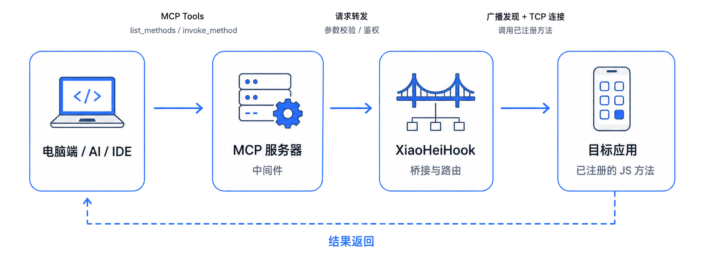

.. _MCP远程调用:

MCP 远程调用
==========================================================

XiaoHeiHook 从 ``1.20 (102)`` 起提供 MCP 远程调用能力。这个功能允许电脑端 MCP Client 调用目标 App 中由 JS 脚本主动注册的方法。
   

   
.. note::

   本功能不是“远程反射任意 Java 方法”。电脑端只能调用脚本通过 ``xhh.rpc.register_method`` 主动暴露的方法。

.. tip::

   如果只是想测试链路，建议先注册一个 ``echo`` 方法，再用 MCP 的 ``invoke_method`` 调用它。这样可以先确认 MCP 服务、桥接通道、目标进程注册和返回值序列化都正常。

设计目标
----------------------------------------------------------

MCP 外层只暴露两个稳定工具：

``list_methods``
    列出当前目标 App 进程已经注册的远程方法。

``invoke_method``
    调用某个 JS 已注册方法，并返回结构化 JSON 结果。

外部电脑端不能直接反射 Java 方法，不能任意读写字段，也不能执行任意 JS。远程可调用能力完全由目标 App 内的 JS 脚本通过 ``xhh.rpc.register_method`` 主动暴露。

.. important::

   MCP 工具名从 ``1.20 (102)`` 起不带 ``xhh.`` 前缀。请使用 ``list_methods`` 和 ``invoke_method``，不要使用旧草案中的 ``xhh.list_methods`` 或 ``xhh.invoke_method``。

启用方式
----------------------------------------------------------

在 XiaoHeiHook 的设置页面中找到 **MCP 远程调用** 卡片，手动打开开关。每次 XiaoHeiHook 主应用重启后，MCP 默认保持关闭，需要用户重新开启。

默认监听地址：

.. code-block:: text

   http://127.0.0.1:18787/mcp

电脑通过 ADB 转发访问：

.. code-block:: bash

   adb forward tcp:18787 tcp:18787

然后 MCP Client 连接：

.. code-block:: text

   http://127.0.0.1:18787/mcp

.. note::

   WebIDE 与 MCP 都是用户手动开启的前台服务。切到后台后会尽量保持运行，但系统强杀、电池冻结或厂商后台限制仍可能影响可访问性。

访问令牌
----------------------------------------------------------

MCP token 是可选的。

启用 token 后，电脑端请求必须携带：

.. code-block:: http

   Authorization: Bearer <token>

不支持 query 参数 token，也不支持额外兜底 header。设置页中的 token 输入框支持左右拖动查看，长按可以复制。

.. warning::

   如果把 MCP 绑定到非 ``127.0.0.1`` 地址，请务必开启 token，并确认只在可信网络中使用。

脚本 grant
----------------------------------------------------------

远程注册脚本建议声明：

.. code-block:: javascript

   // @grant        rpc.register

调试 MCP bridge 内部流程时可额外声明：

.. code-block:: javascript

   // @grant        mcp.debug

或者开启全局内部调试日志：

.. code-block:: javascript

   // @grant        xhh.debug

.. note::

   ``mcp.debug`` 和 ``xhh.debug`` 只控制内部日志输出，不授予远程调用能力。远程注册能力由 ``rpc.register`` 表达。

JS 注册方法
----------------------------------------------------------

.. tip::
	完整代码可以在 https://github.com/wojiaoyishang/XiaoHeiCat/tree/master/examples/mcp_tool_register.js 查看。

最小示例：

.. code-block:: javascript

	// ==LSPosedScript==
	// @name         MCP Echo Test
	// @namespace    XiaoHeiHook
	// @version      1.0
	// @description  注册一个 MCP 远程调用 echo 方法，用于测试 invoke_method
	// @target       *
	// @grant        rpc.register
	// @grant        xhh.debug
	// @grant        mcp.debug
	// ==/LSPosedScript==

   xhh.rpc.register_method("echo", function (params, ctx) {
     return {
       ok: true,
       received: params,
       requestId: ctx.requestId,
       timestamp: Date.now()
     }
   })

带注册选项：

.. code-block:: javascript

   xhh.rpc.register_method("get_user_token", {
     description: "获取当前用户 token",
     conflict: "overwrite",
     timeoutMs: 5000,
     concurrency: "parallel",
     paramsSchema: {
       type: "object",
       properties: {
         forceRefresh: { type: "boolean" }
       }
     }
   }, async function (params, ctx) {
     return {
       token: "..."
     }
   })

``register_method`` 参数
----------------------------------------------------------

``xhh.rpc.register_method`` 有两个调用形式：

.. code-block:: javascript

   xhh.rpc.register_method(name, handler)
   xhh.rpc.register_method(name, options, handler)

.. list-table:: register_method 参数
   :header-rows: 1
   :widths: 25 25 50

   * - 参数
     - 类型
     - 说明
   * - ``name``
     - ``String``
     - 远程方法名。不能为空。同一个 ``packageName + processName`` 下方法名唯一。
   * - ``options``
     - ``Object``
     - 可选注册参数。省略时使用默认值。
   * - ``handler``
     - ``Function``
     - 实际处理远程调用的 JS 函数，形式为 ``function(params, ctx)``。

``options`` 字段如下：

.. list-table:: register_method options
   :header-rows: 1
   :widths: 25 20 20 35

   * - 字段
     - 类型
     - 默认值
     - 说明
   * - ``description``
     - ``String``
     - 空字符串
     - 方法说明，会通过 ``list_methods`` 返回。
   * - ``conflict``
     - ``String``
     - ``overwrite``
     - 重复注册策略，支持 ``overwrite``、``ignore``、``error``。
   * - ``timeoutMs``
     - ``Number``
     - ``5000``
     - 默认调用超时。外部调用可覆盖，但会被限制在安全范围内。
   * - ``concurrency``
     - ``String``
     - ``parallel``
     - 执行策略，支持 ``parallel``、``main``、``serial``。
   * - ``paramsSchema``
     - ``Object``
     - 空
     - 参数 JSON Schema，用于让外部调用者理解参数结构。

.. tip::

   初学者建议先只使用 ``parallel``。涉及 UI、View、Activity 或主线程对象时，再考虑使用 ``main``。

重复注册策略
----------------------------------------------------------

``conflict`` 支持三种取值：

``overwrite``
    默认值。已有同名方法时覆盖旧 handler。

``ignore``
    已有同名方法时忽略本次注册，保留旧 handler。

``error``
    已有同名方法时返回注册冲突错误。

作用域为：

.. code-block:: text

   packageName + processName + methodName

``register_method`` 返回值
----------------------------------------------------------

注册成功时返回类似：

.. code-block:: json

   {
     "ok": true,
     "ignored": false,
     "methodName": "echo",
     "handlerId": "uuid",
     "conflict": "overwrite"
   }

MCP 未开启或 bridge 不可用时返回类似：

.. code-block:: json

   {
     "ok": true,
     "ignored": true,
     "reason": "mcp-bridge-unavailable",
     "methodName": "echo"
   }

Application Context 尚未就绪时，注册会被暂存并稍后刷新：

.. code-block:: json

   {
     "ok": true,
     "pending": true,
     "reason": "context-not-ready",
     "methodName": "echo"
   }

参数错误时返回类似：

.. code-block:: json

   {
     "ok": false,
     "ignored": true,
     "error": "handler is required"
   }

.. note::

   目标 App 没有任何远程方法注册时，不会初始化 bridge，不会广播发现，也不会保持 socket 连接。

handler 参数与返回值
----------------------------------------------------------

handler 形式为：

.. code-block:: javascript

   function (params, ctx) {
     return result
   }

``params`` 来自外部 MCP ``invoke_method`` 的 ``params`` 字段。建议只传递 JSON 可表示的数据，例如对象、数组、字符串、数字、布尔值或 ``null``。

``ctx`` 包含：

.. list-table:: handler ctx 字段
   :header-rows: 1
   :widths: 30 25 45

   * - 字段 / 方法
     - 类型 / 返回值
     - 说明
   * - ``ctx.requestId``
     - ``String``
     - 本次远程调用的请求 ID。
   * - ``ctx.packageName``
     - ``String``
     - 当前目标包名。
   * - ``ctx.processName``
     - ``String``
     - 当前目标进程名。
   * - ``ctx.timeoutMs``
     - ``Number``
     - 本次调用的超时时间。
   * - ``ctx.cancelled``
     - ``boolean``
     - 当前调用是否已取消。当前主要作为预留字段。
   * - ``ctx.isCancelled()``
     - ``boolean``
     - 返回当前调用是否已取消。
   * - ``ctx.throwIfCancelled()``
     - ``void``
     - 如果已取消则抛出异常。当前主要作为预留能力。
   * - ``ctx.log(message)``
     - ``void``
     - 写入脚本日志，便于排查远程调用。

handler 返回值会被序列化为 JSON 再返回给 MCP Client。推荐返回普通 JSON 对象：

.. code-block:: javascript

   return {
     ok: true,
     data: {
       userId: "10001"
     }
   }

.. warning::

   不建议直接返回 Java ``Context``、``Class``、``Method``、``View`` 等复杂对象。它们可能被转成字符串，也可能因为序列化失败而返回错误。

注销方法
----------------------------------------------------------

取消注册单个方法：

.. code-block:: javascript

   xhh.rpc.unregister_method("echo")

返回示例：

.. code-block:: json

   {
     "ok": true,
     "methodName": "echo"
   }

取消当前运行时中的全部远程方法：

.. code-block:: javascript

   xhh.rpc.unregister_all_methods()

返回示例：

.. code-block:: json

   {
     "ok": true
   }

如果注销后没有剩余远程方法，目标 Runtime 会主动关闭 bridge 连接。

MCP 工具：list_methods
----------------------------------------------------------

``list_methods`` 用于查看目标 App 当前注册了哪些远程方法。

输入示例：

.. code-block:: json

   {
     "packageName": "cn.am7code.tools",
     "processName": "cn.am7code.tools",
     "includeSchema": true
   }

.. list-table:: list_methods 参数
   :header-rows: 1
   :widths: 28 22 50

   * - 参数
     - 类型
     - 说明
   * - ``packageName``
     - ``String``
     - 目标 App 包名。必填。
   * - ``processName``
     - ``String``
     - 目标进程名。可选，省略时匹配该包下所有活跃进程。
   * - ``includeSchema``
     - ``boolean``
     - 是否返回 ``paramsSchema``。可选，默认建议传 ``true``。

返回示例：

.. code-block:: json

   {
     "ok": true,
     "packageName": "cn.am7code.tools",
     "processName": "",
     "methods": [
       {
         "packageName": "cn.am7code.tools",
         "processName": "cn.am7code.tools",
         "methodName": "echo",
         "description": "Echo MCP input params back to caller",
         "timeoutMs": 5000,
         "concurrency": "parallel",
         "scriptName": "mcp_tool_register",
         "scriptPath": "mcp_tool_register.js",
         "registeredAt": 1730000000000,
         "lastSeenAt": 1730000000000,
         "transport": "tcp",
         "paramsSchema": {
           "type": "object",
           "additionalProperties": true
         }
       }
     ]
   }

MCP 工具：invoke_method
----------------------------------------------------------

``invoke_method`` 用于调用一个已注册的远程方法。

输入示例：

.. code-block:: json

   {
     "packageName": "cn.am7code.tools",
     "processName": "cn.am7code.tools",
     "methodName": "echo",
     "params": {
       "message": "hello"
     },
     "timeoutMs": 5000
   }

.. list-table:: invoke_method 参数
   :header-rows: 1
   :widths: 28 22 50

   * - 参数
     - 类型
     - 说明
   * - ``packageName``
     - ``String``
     - 目标 App 包名。必填。
   * - ``processName``
     - ``String``
     - 目标进程名。可选，省略时选择该包下匹配到的活跃进程。
   * - ``methodName``
     - ``String``
     - 要调用的远程方法名。必填。
   * - ``params``
     - ``Object | Array | String | Number | Boolean | null``
     - 传给 JS handler 的参数。可选，默认为空对象。
   * - ``timeoutMs``
     - ``Number``
     - 本次调用超时。可选，默认使用注册方法的 ``timeoutMs``。

成功返回示例：

.. code-block:: json

   {
     "ok": true,
     "requestId": "req_xxx",
     "result": {
       "ok": true,
       "received": {
         "message": "hello"
       }
     }
   }

失败返回示例：

.. code-block:: json

   {
     "ok": false,
     "requestId": "req_xxx",
     "error": {
       "code": "METHOD_NOT_FOUND",
       "message": "No registered method: echo"
     }
   }

常见错误码：

.. list-table:: invoke_method 常见错误码
   :header-rows: 1
   :widths: 30 70

   * - 错误码
     - 说明
   * - ``MCP_DISABLED``
     - MCP 服务未开启。
   * - ``METHOD_NOT_FOUND``
     - 找不到对应远程方法，可能没有注册或目标进程已下线。
   * - ``TARGET_OFFLINE``
     - 目标进程连接已断开。
   * - ``TIMEOUT``
     - 调用超时。
   * - ``INVOKE_FAILED``
     - JS handler 执行失败。
   * - ``INVALID_ARGUMENT``
     - 调用参数不合法。
   * - ``TOOL_NOT_FOUND``
     - MCP tool 名称不存在。

内部通信模型
----------------------------------------------------------

当前实现使用 **广播发现 + 动态 TCP bridge**：

.. code-block:: text

   电脑 MCP Client
       -> XiaoHeiHook MCP HTTP Server
       -> XiaoHeiHook 动态 TCP bridge
       -> 目标 App JsHookRuntime
       -> JS register_method handler

目标 App 第一次调用 ``xhh.rpc.register_method(...)`` 时才会初始化内部连接。如果没有任何远程方法注册，不会广播、不创建 socket、不启动 heartbeat。

发现流程：

#. 目标 App 发送有序广播 ``top.lovepikachu.XiaoHeiHook.MCP_BRIDGE_DISCOVER``。
#. 如果 MCP 没开启或没有响应，注册直接 ignored，不报错、不重试。
#. 如果收到响应，目标 App 获取当前 bridge 的 host、port 和内部 token。
#. 目标 App 连接 ``127.0.0.1:<动态端口>``，发送注册 frame。

这样可以兼容隐藏应用列表场景：目标 App 不需要查询 XiaoHeiHook 包，也不需要绑定 exported service。

.. tip::

   外部 MCP HTTP 端口默认是 ``18787``；内部 TCP bridge 使用动态端口，不需要用户手动配置，也避免端口占用。

生命周期
----------------------------------------------------------

注册方法只保存在内存中，不持久化。

目标 App 成功注册后，会和 XiaoHeiHook MCP 进程保持 TCP 长连接。目标 App 关闭、崩溃或进程被杀时，连接断开，XiaoHeiHook 会立即清理该 session 下的所有方法和 pending 调用。

当目标脚本调用 ``unregister_method`` 或 ``unregister_all_methods`` 后，如果没有剩余远程方法，目标 Runtime 会主动关闭 bridge 连接。

重启与调试提示
----------------------------------------------------------

WebIDE 或 App 内触发“同步并重启”时，XiaoHeiHook 会优先使用 root 执行：

.. code-block:: bash

   am force-stop <packageName>

如果没有 root 或终止失败，会在对应 App 日志中写入提示，要求用户手动终止并重启。App UI 内触发时会额外 Toast 提示“终止程序失败，请手动终止后重启；已尝试打开应用”。即使终止失败，XiaoHeiHook 仍会尝试通过启动入口打开目标 App。

日志排查
----------------------------------------------------------

MCP bridge 相关日志统一使用：

.. code-block:: text

   XiaoHeiHook-MCP-Bridge

常用命令：

.. code-block:: bash

   adb logcat | findstr /i "XiaoHeiHook-MCP-Bridge"

默认情况下，MCP 内部调试日志不会大量输出。需要详细排查时，在脚本 meta 中添加：

.. code-block:: javascript

   // @grant        mcp.debug

常见日志含义：

``MCP bridge discovery broadcast``
    目标 App 正在查询当前 bridge 地址。

``reply MCP bridge discovery``
    XiaoHeiHook MCP 已响应 host/port。

``MCP bridge discovery no response``
    MCP 未运行或未响应，本次注册会 ignored。

``MCP bridge TCP connected``
    目标 App 已连接 bridge。

``register socket method``
    方法已注册到 registry。

``MCP bridge session offline``
    目标 App 断开，方法已自动注销。

源码位置
----------------------------------------------------------

开发者审计时可从以下文件开始阅读：

.. list-table:: MCP 远程调用源码位置
   :header-rows: 1
   :widths: 40 60

   * - 文件
     - 作用
   * - ``app/src/main/java/top/lovepikachu/XiaoHeiHook/mcp/McpForegroundService.kt``
     - MCP 前台服务，负责启动/停止 MCP HTTP Server 和内部 bridge。
   * - ``app/src/main/java/top/lovepikachu/XiaoHeiHook/mcp/McpHttpServer.kt``
     - MCP HTTP 入口，处理 ``initialize``、``tools/list``、``tools/call`` 等请求。
   * - ``app/src/main/java/top/lovepikachu/XiaoHeiHook/mcp/McpToolDefinitions.kt``
     - 定义 ``list_methods`` 与 ``invoke_method`` 的 schema。
   * - ``app/src/main/java/top/lovepikachu/XiaoHeiHook/mcp/McpMethodRegistry.kt``
     - 保存活跃 session、注册方法、pending 调用，并负责方法路由。
   * - ``app/src/main/java/top/lovepikachu/XiaoHeiHook/mcp/McpBridgeTcpServer.kt``
     - 动态 TCP bridge 服务端。
   * - ``app/src/main/java/top/lovepikachu/XiaoHeiHook/mcp/McpBridgeDiscoveryReceiver.kt``
     - 响应目标 App 的 bridge 发现广播。
   * - ``app/src/main/java/top/lovepikachu/XiaoHeiHook/script/JsHookRuntime.java``
     - 注入 ``xhh.rpc``，保存 JS handler，并执行远程调用。
   * - ``app/src/main/java/top/lovepikachu/XiaoHeiHook/XhhConstants.java``
     - 统一版本常量，例如 ``VERSION_NAME``、``VERSION_CODE``、``MCP_BRIDGE_VERSION``。

.. note::

   文件名可能随后续重构微调。审计时可以从类名和 tag ``XiaoHeiHook-MCP-Bridge`` 反向搜索。
