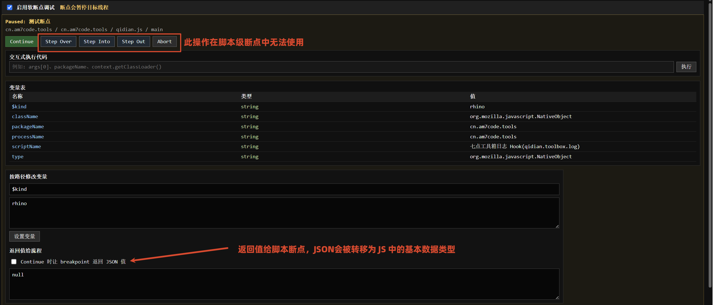
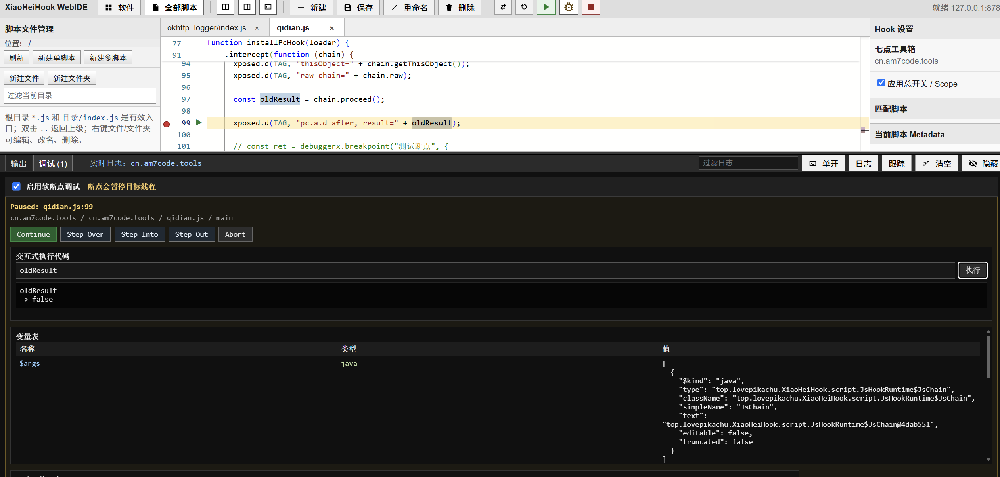

断点调试
==================

在 WebIDE 中允许对脚本进行断点调试，需要注意的是，断点调试仅作用于 JS 脚本，而不能进入到目标应用的 Java 层中，不过对于 Hook 某方法之后进行参返观察很有用。

.. tip::
	使用断点时，请确保在 WebIDE 中，终端区域的 “调试” 选项卡中，勾选了 “启用软断点调试”，否则断点将不会生效。
	**并且所有断点操作，都是在 “调试运行” 下才能正常启用的。**

脚本级断点
----------------

脚本级断点语法请参考： :ref:`脚本级断点` 章节，在设置具体断点断住之后，会在终端区域展示相关信息：

测试的代码如下：

.. code-block:: javascript

	const ret = debuggerx.breakpoint("测试断点", {
		packageName: env.packageName,
		processName: env.processName,
		scriptName: env.scriptName
	});

	if (ret !== null && ret !== undefined) {
		console.log("设置用户给定的返回值", ret);
		return ret
	}
	
调试时，运行到断点处展示：

变量表中会展示传入给 breakpoint 的变量，如果提供返回值，ret 将会接受这个值并提供给流程。

**此外，步行、步进，在使用脚本级断点时不会生效。**

行断点
----------------

在编辑器行号左侧点击即可添加行级断点，调试时，使用的逻辑与软件断点基本一致，不过可以执行任意代码，以灵活查看对应的变量，或执行自定义流程。

   
:: note:
	此外，需要注意的是，变量列表展示的类型往往是不精准的，因为部分变量翻译于 Java 层，所以对于显示 “java” 类型的变量实际上是一个无法被 JS 解释的变量，其对应的变量值是一个相对客观的 meta 对象，但是您仍然可以使用自定义流程调用其中的方法（如果这个对象存在方法）。