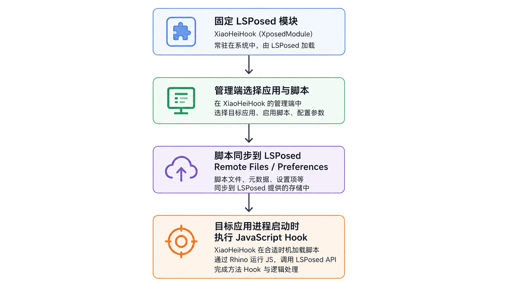

项目简介
==================

.. warning::
	模块属于自用开发阶段，出现问题请提 PR ，不确保不同品牌手机的兼容性。
	
	此模块的开发服务于 **方便个人逆向** 所搭建的一套工具集，大部分代码由 **语言模型编写** ，大部分代码经过审计与测试，但仍然不能保证不同设备上的可靠性，请三思之后使用此模块。

XiaoHeiHook 是 **一个基于现代 LSPosed 与 Rhino 的动态 Hook 脚本模块**。

目标是让开发者能够使用极简的 JS 脚本调用 LSPosed 提供的强大 Hook 功能，而无需为了每个应用程序都撰写一个独立的 LSPosed 模块。

在现代设备上，LSPosed 注入的隐藏能力已经远大于 Firda 脚本，使用 LSPosed 框架编写代码可以减少大部分环境问题。

此外，模块提供进程内脱壳与 Dex 分析能力，可用真实 App ClassLoader dump 全部脱壳 Dex、定位目标方法所在 Dex、inspect 方法体特征，并再用于精准 Hook。

此外，该模块尝试提供一种类似 Firda 脚本的体验：

- **快速上手**：只需编写 JS 脚本，无需额外 Java/Kotlin 开发。
- **多应用支持**：同一脚本可在不同应用中复用，并能针对每个应用独立配置开关和参数。
- **动态执行**：脚本可在目标应用运行时被加载、修改和调试，无需重启应用或重新安装模块。
- **可视化配置**：提供丰富的设置项支持，包括布尔值、数字、字符串、下拉选择、多选、列表等类型，让脚本行为可控。
- **兼容性与安全性**：封装 LSPosed 现代接口，保证 Hook 稳定运行，同时通过脚本沙箱和 schema 校验减少运行时错误和安全风险。
- **开发者友好**：提供 WebIDE 和日志系统支持，方便调试、断点和查看远程日志，形成完整的开发闭环。

总体而言，XiaoHeiHook 的设计理念是 **“轻量 JS + 强大 Hook”**，它把 LSPosed 的复杂 Hook 逻辑抽象成可直接使用的 JS 接口，让开发者专注于业务逻辑而非底层实现，同时兼顾安全性与可维护性。

它解决的问题
-----------------

传统 Xposed 模块通常需要为每一次逻辑修改重新编译、安装、重启目标应用，调试成本较高。
XiaoHeiHook 将固定模块与动态脚本拆开：模块负责接入 LSPosed、同步脚本、创建 JS Runtime；脚本负责描述具体 Hook 行为。

因此你可以把它理解为：

核心特性
-----------------

- 使用 Rhino 执行 JavaScript 脚本。
- 使用现代 libxposed 风格链式 Hook API。
- 支持按应用启用脚本。
- 支持按应用、按脚本保存独立设置项。
- 支持多文件脚本与 CommonJS ``require``。
- 支持手机端管理脚本和 WebIDE 在线编写脚本。
- 支持终端日志查看、实时日志流与外部编辑器打开日志。
- 支持脚本行断点、软断点相关调试接口。

基本概念
-----------------

应用开关
~~~~~~~~~~~~~~~

应用开关用于控制某个包名是否允许执行 XiaoHeiHook 脚本。即使脚本本身匹配目标应用，如果应用开关没有打开，脚本也不会运行。

脚本开关
~~~~~~~~~~~~~~~

脚本开关用于控制某个应用下的某个脚本是否启用。同一个脚本可以在多个应用中分别启用或关闭。

脚本设置
~~~~~~~~~~~~~~~

脚本可以通过目录中的 ``settings.json`` 声明可视化设置项。用户配置不会写回脚本目录，而是按 ``packageName + scriptId`` 保存到 Remote Preferences。

WebIDE
~~~~~~~~~~~~~~~

WebIDE 是手机端启动的本地网页 IDE。电脑通过浏览器访问后，可以管理应用、编辑脚本、修改 Hook 设置、查看控制台日志。

参考文档与帮助
-----------------

如果你在使用过程中遇到问题，建议优先查阅项目文档：

- 项目文档：https://lab.lovepikachu.top/document/xiaoheihook/
- 开源仓库：https://github.com/wojiaoyishang/XiaoHeiCat/
- 问题反馈：https://github.com/wojiaoyishang/XiaoHeiCat/issues
- 功能建议：欢迎提交 Issue 或 Pull Request

XiaoHeiHook 的设计与实现过程中参考了以下优秀项目，同时有助于您更好地开发脚本：

- LSPosed（现代 Xposed 框架）：https://github.com/LSPosed/LSPosed
- Modern Xposed API（libxposed）：https://github.com/libxposed
- Rhino JavaScript Engine：https://github.com/mozilla/rhino
- JsHook： https://github.com/Xposed-Modules-Repo/me.jsonet.jshook
- SimpleHook：https://github.com/Xposed-Modules-Repo/com.github.kyuubiran.simplehook

最小示例
-----------------

.. tip::
	.. raw:: html

	   

	   
查看极简示例完整代码

	.. code-block:: javascript

	   // ==LSPosedScript==
	   // @name         脚本名称
	   // @id           example.script.test
	   // @version      1.0.0
	   // @author       XiaoHeiHook
	   // @description  极短的 Hook 示例
	   // @target       com.example.app
	   // @process      *
	   // @run-at       package-loaded
	   // @grant        java.full
	   // @grant        xposed.full
	   // @grant        xposed.raw
	   // ==/LSPosedScript==

	   xposed.onPackageLoaded(function (param) {
		 console.log("脚本加载成功：", "package=", param.getPackageName(), "process=", env.processName);

		 const loader = param.getClassLoader();
		 const method = loader.loadClass("pc.a").getDeclaredMethod("d");
		 method.setAccessible(true);

		 xposed.hook(method)
		   .setPriority(xposed.PRIORITY_DEFAULT)
		   .setExceptionMode(xposed.ExceptionMode.PROTECTIVE)
		   .intercept(function (chain) {
			 const args = chain.getArgsMutable();
			 return chain.proceed(args);
		   });
	   });

	.. raw:: html

	   

