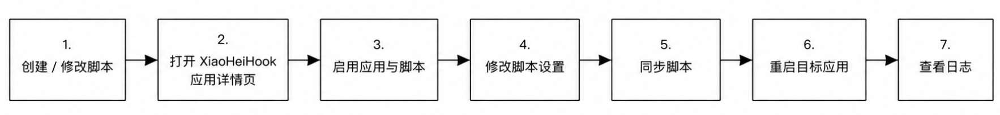
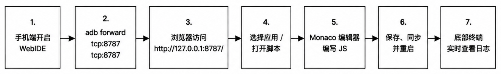

推荐工作流
==================

手机端工作流
-----------------

适合少量脚本管理：

   
**注意：手机App不具备脚本编辑的功能，脚本编辑功能只在 WebIDE 提供，手机仅提供脚本启用、设置功能。**

WebIDE 工作流
-----------------

请查阅 :ref:`WebIDE使用` 章节，此方式适合电脑端持续开发：

.. tip::
   推荐先绑定 ``127.0.0.1``，再通过 ``adb forward`` 访问 WebIDE。绑定到 ``0.0.0.0`` 或局域网地址会暴露脚本编辑入口，请谨慎使用。
